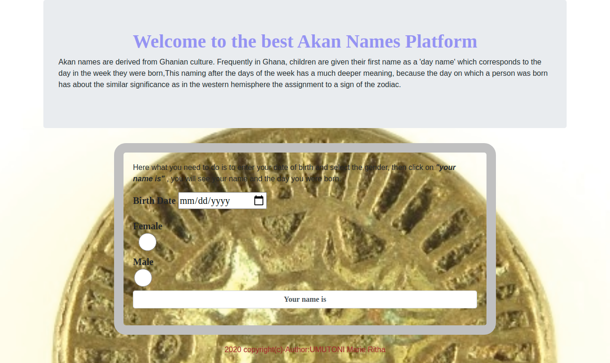

# {Akan Name}
#### {A Proctect that will display the name of Akan based on brthday}, {26 September 2020}
#### By **{UMUTONI Marie Ritha}**
## Description
{Akan names are derived from Ghanian culture. Frequently in Ghana, children are given their first name as a 'day name' which corresponds to the day in the week they were born. }
## Setup/Installation Requirements
* UBUNTU
* Open Terminal
* Google Chrome
* internet
* [git clone] (https://github.com/UMUTONIRitha/Akan-project.git)
## Technologies Used
* HTML
* CSS
* JavaScript
* Bootstrap
## BDD
* Enter a birthday and select the gender
* Click on your name is
* Take the birthday and get the day
* Asiign the day to the list of days
* Check if entered birthday and gender isnot null
* Nested if the condition is true assign days to the female's name else assign the day to male's name
* if the birthday AND gender is null then ask user to enter birthday and select gender
## How Akan Project look

## Contact Information
{feel free to contact me via E-mail: rithamarie9@gmail.com in case you need any support or contribution.}
### License
* MIT license,Copyright (c) {2020} **{UMUTONI Marie Ritha}**
